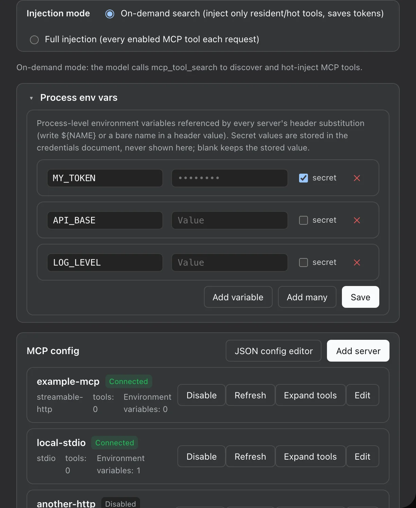

# dsh-mcp — MCP server management plugin for DeepSeek Harness (standalone)

[](https://dshfind.com/en/plugins/ArvinQi/dsh-mcp?ref=badge)



Migrated and merged from uncommitted MCP work in the `deepseek-harness` repository:

| Original package | Migrated to |
|---|---|
| `packages/mcp/mcp-manager` (host registry) | `lib/index.js` (host half) |
| `packages/client/ui-settings-mcp` (settings UI) | `src/client/*` → `lib/client.js` (browser half) |
| `packages/bundle/web-mcp` (bundle assembly) | single row registered via `cordis.patch.yml` |
| `packages/mcp/mcp-client/src/probe.ts` + `transport.ts` | `lib/probe.js` + `lib/transport.js` (vendored; no in-box changes) |

## Features

- **Managed MCP server registry** (host): persistent definitions (storage-domain `mcp_servers`), per-server
  `@deepseek-ai/dsh-mcp-client` mounts, environment variable injection (plain values in the definition, secrets via credentials),
  connection probe (`test`).
- **Web settings page** (client): Settings → MCP — list / edit / delete / test servers.
- **Server-level enable/disable**: disabling a server unmounts it and unregisters its tools immediately.
- **Per-server refresh** button: re-pulls server status and tool list.
- **Tool control**:
  - Injection mode: `search` (on-demand, default — the model hot-injects tools via `mcp_tool_search`) and `full` (inject every enabled tool each request).
  - Expandable per-server tool list, all checked by default; unchecking a tool keeps it out of injection. Changes take effect immediately.
- **Remote self-mount**: the client half mounts the `mcpManager` Remote namespace itself via `ctx.remote.$mount()` in `apply()`,
  so no in-box package modification is required.
- Zero npm runtime dependencies (`@deepseek-ai/*` resolve from the DSH profiles module fallback).

## Structure

```
dsh-mcp/
├── package.json          name=dsh-mcp; dsh.client declaration; zero npm dependencies
├── lib/
│   ├── index.js          host half (McpManagerService, built from mcp-manager)
│   ├── probe.js          vendored connection probe (from mcp-client/src/probe.ts)
│   ├── transport.js      vendored transport factory (from mcp-client/src/transport.ts)
│   └── client.js         browser half (esbuild bundle, ModuleLoader wire format)
├── src/client/           browser half source (TSX + CSS Modules + local types + remote-contribution)
└── scripts/build.mjs     build script (esbuild resolved from a DSH checkout, see below)
```

## Build

```sh
node scripts/build.mjs
```

- esbuild is resolved from a DSH source checkout: `$DSH_SOURCE`, or `~/.dsh/source/current` when unset.
- Runtime dependencies (`@deepseek-ai/*`, `zod`, `@modelcontextprotocol/sdk`) are not installed as npm packages;
  they resolve from `$DSH_HOME/profiles/node_modules` (DSH profiles module fallback, `$DSH_HOME` defaults to `~/.dsh`);
  the build points `nodePaths` at the same directory.
- CSS Modules are handled by an esbuild onLoad plugin: styles are injected into a
  `<style data-plugin="dsh-mcp" data-file="…">` tag, and the module default-exports an identity class-name map.

## Install

### Option 1: npm (after publishing)

```sh
dsh plugin --profile web add dsh-mcp
```

### Option 2: GitHub git source

```sh
dsh plugin --profile web add github:ArvinQi/dsh-mcp
# or
dsh plugin --profile web add git+https://github.com/ArvinQi/dsh-mcp.git
```

### Option 3: local development (link)

```sh
dsh plugin --profile web add link:<absolute path to this repo>
```

> Note: with a local `link:` install, the plugin directory needs a `node_modules -> $DSH_HOME/profiles/node_modules`
> symlink (development-only, not committed); otherwise the linked symlink is realpath-resolved and `@deepseek-ai/*`
> cannot be resolved.

### Registration (all install options)

Append to `$DSH_HOME/profiles/web/cordis.patch.yml` (`$DSH_HOME` defaults to `~/.dsh`):

```yaml
- insert:
    - id: dsh-mcp
      name: dsh-mcp
```

Then **restart `dsh web`** (client roster changes require a restart); afterwards hard-refresh the browser
(`Cmd/Ctrl + Shift + R`) to load the settings page.

## Versioning notes

- The host half `lib/index.js` is a **build artifact** of mcp-manager (spec/types inlined); edit the lib files
  directly, or rebuild from TypeScript with the repository toolchain.
- After changing `src/client/*`, re-run `node scripts/build.mjs`; host-half changes take effect without
  reinstalling (link install).
- Configuration changes (bundle additions/removals, new plugin rows) require restarting `dsh web` to enter
  the client roster.

## Changelog

See [CHANGELOG.md](CHANGELOG.md). Released under the [MIT License](LICENSE).

[](https://dshfind.com/en/plugins/ArvinQi/dsh-mcp?ref=badge)
