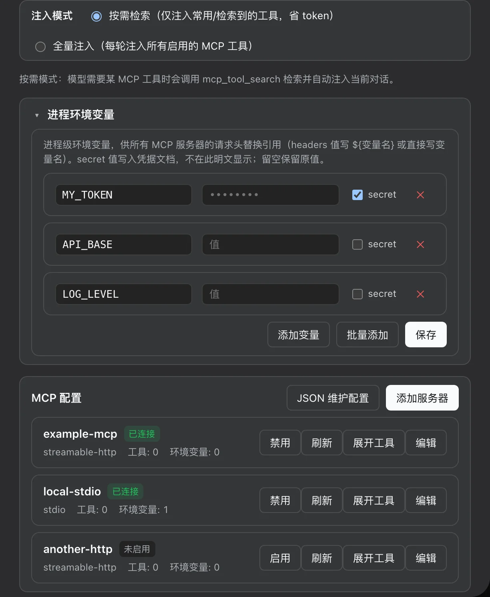

# dsh-mcp — MCP 服务器管理插件（独立版）

**[English](README.en.md) | 简体中文**

[](https://dshfind.com/zh/plugins/ArvinQi/dsh-mcp?ref=badge)



## 功能

- **托管 MCP 服务器注册表**（host）：持久化定义（storage-domain `mcp_servers`）、按服务器挂载
  `@deepseek-ai/dsh-mcp-client` 实例、环境变量注入（明文入定义、secret 走 credentials）、
  连接探测（test）。
- **Web 设置管理页**（client）：Settings → MCP，列表/编辑/删除/测试服务器。
- **Remote 自挂载**：client 半部在 `apply()` 里自行 `ctx.remote.$mount()` 挂载 `mcpManager`
  命名空间（原实现依赖 api-remotes 的 in-box 修改，独立版不再需要任何 in-box 包改动）。

## 结构

```
dsh-mcp/
├── package.json          name=dsh-mcp；dsh.client 声明；零 npm dependencies
├── lib/
│   ├── index.js          host 半部（McpManagerService，源自 mcp-manager 构建产物）
│   ├── probe.js          vendored 连接探测（源自 mcp-client/src/probe.ts）
│   ├── transport.js      vendored 传输工厂（源自 mcp-client/src/transport.ts）
│   └── client.js         浏览器半部（esbuild 打包，ModuleLoader wire format）
├── src/client/           浏览器半部源码（TSX + CSS Modules + 本地 types + remote-contribution）
└── scripts/build.mjs     构建脚本（esbuild 取自 DSH checkout，见下）
```

## 构建

```sh
node scripts/build.mjs
```

- esbuild 从 DSH 源码 checkout 解析：`$DSH_SOURCE` 未设置时尝试
  `~/.dsh/source/current`。
- 运行时依赖（`@deepseek-ai/*`、`zod`、`@modelcontextprotocol/sdk`）不装 npm 包，
  从 `$DSH_HOME/profiles/node_modules`（DSH profiles 模块 fallback，`$DSH_HOME` 默认 `~/.dsh`）解析；构建时经
  `nodePaths` 指向同一目录。
- CSS Modules 由 esbuild onLoad 插件处理：样式注入
  `<style data-plugin="dsh-mcp" data-file="…">`，默认导出 identity 类名映射。

## 安装

### 方式一：npm（发布到 npm 后）

```sh
dsh plugin --profile web add dsh-mcp
```

### 方式二：GitHub git 源

```sh
dsh plugin --profile web add github:ArvinQi/dsh-mcp
# 或
dsh plugin --profile web add git+https://github.com/ArvinQi/dsh-mcp.git
```

### 方式三：本地开发（link）

```sh
dsh plugin --profile web add link:<本仓库绝对路径>
```

> 注意：本地 `link:` 安装时，插件目录内含 `node_modules -> $DSH_HOME/profiles/node_modules`
> symlink（本机开发用，不入库），否则 `link:` 安装的 symlink 被 realpath 后无法解析
> `@deepseek-ai/*`。

### 注册与生效（三种方式通用）

在 `$DSH_HOME/profiles/web/cordis.patch.yml`（`$DSH_HOME` 默认 `~/.dsh`）追加：

```yaml
- insert:
    - id: dsh-mcp
      name: dsh-mcp
```

然后**重启 `dsh web`**（client roster 变更需重启）；之后浏览器硬刷新（`Cmd/Ctrl + Shift + R`）
加载设置页。

## 版本注意

- host 半部 `lib/index.js` 是 mcp-manager 的**构建产物**（spec/types 已内联），改动请直接编辑
  lib 下文件，或改回 TS 后重新用仓库工具链构建。
- 浏览器半部改 `src/client/*` 后重新 `node scripts/build.mjs`；host 半部改动无需重装
  （link 安装直接生效）。
- 配置变更（bundles 增删、新插件行）需重启 `dsh web` 才进入 client roster。

[](https://dshfind.com/zh/plugins/ArvinQi/dsh-mcp?ref=badge)
